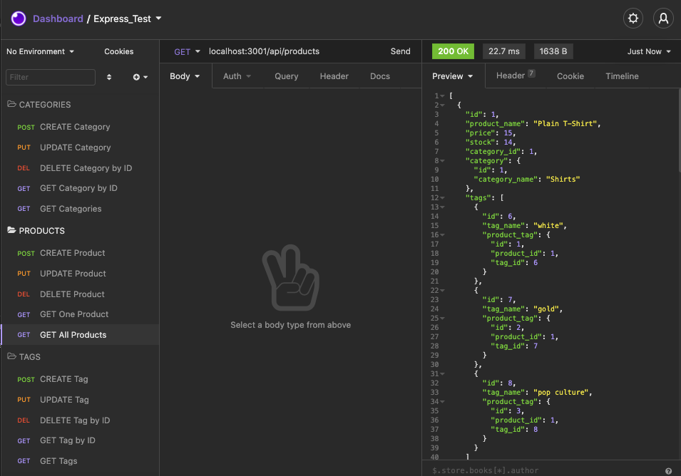

# ORM Back End Ecommerce Application

## Table of Contents
  
* [Description](#description)
* [Installation](#installation)
* [Usage](#usage)
* [Contributing](#contributing)
* [Tests](#tests)
* [Questions](#questions)
* [License](#license)
  
## Description 
  
Application that provides the back end for an e-commerce site. The app uses an Express.js configured API and utilises Sequelize to interact with a MySQL database.

Database name, MySQL username, and MySQL password are inputted in an environment variable file (env), which allows connection to a database using Sequelize.

Schema and seed commands allow for a development database to be created and seeded with test data. 

The Node server.js command to invokes the application, starts the server on port 3001 and syncs the Sequelize models to the MySQL database. 

All routes have been tested in Insomnia Core and a demonstration video supplied illustrates the functioning actions of GET, POST, PUT and DELETE via the API. with the data for these routes in a formatted JSON. These requests respectively show how the user can successfully request, create, update, and delete data in the database.

## Installation
  
To install the project please use the following package manager: 
  
enter 'npm init' in the terminal. 

Please ensure dev dependencies dotenv, express, mysql2 and sequelize are all installed (npm install {package}.

  
## Usage
  
Download, install NPM packages, enter node server.js to invoke server and run the app.

Enter pasword and user details in the .env file.

please run 'npm run seed' to seed the data from the 'ecommerce_db' database. 

## Contributing
  
To contribute further on this project please:
  
n/a 
  
## Tests
  
Insomnia Core has been used to validate the routes and actions of PUT, POST, CREATE, DELETE. 

Please see accompanying video for validation. 
  
## Questions
  
For any further questions, please contact GitHub user: 
[ThomWilliams](https://www.github.com/ThomWilliams/) 

Or for direct enquiries please email the follower developer address: 
thomwilliams1990@gmail.com 
  

## Screenshots

## Walkthrough Video

The following walkthrough video demonstrates, 

- [Watch Video](https://drive.google.com/file/d/1L_58FHnRaA0GuCR7qEstFiSt8aOUa-0n/view?usp=sharing)

## Deployment / Links

- Project Repository: [GitHub](https://github.com/ThomWilliams/orm-back-end-ecommerce-tew.git)

- Issue tracker: [GitHub Issues](https://github.com/ThomWilliams/orm-back-end-ecommerce-tew/issues)

## License
  
MIT 

Copyright (c) [2021] [Thomas Edward Williams]

Permission is hereby granted, free of charge, to any person obtaining a copy
of this software and associated documentation files (the "Software"), to deal
in the Software without restriction, including without limitation the rights
to use, copy, modify, merge, publish, distribute, sublicense, and/or sell
copies of the Software, and to permit persons to whom the Software is
furnished to do so, subject to the following conditions:

The above copyright notice and this permission notice shall be included in all
copies or substantial portions of the Software.

THE SOFTWARE IS PROVIDED "AS IS", WITHOUT WARRANTY OF ANY KIND, EXPRESS OR
IMPLIED, INCLUDING BUT NOT LIMITED TO THE WARRANTIES OF MERCHANTABILITY,
FITNESS FOR A PARTICULAR PURPOSE AND NONINFRINGEMENT. IN NO EVENT SHALL THE
AUTHORS OR COPYRIGHT HOLDERS BE LIABLE FOR ANY CLAIM, DAMAGES OR OTHER
LIABILITY, WHETHER IN AN ACTION OF CONTRACT, TORT OR OTHERWISE, ARISING FROM,
OUT OF OR IN CONNECTION WITH THE SOFTWARE OR THE USE OR OTHER DEALINGS IN THE
SOFTWARE.

